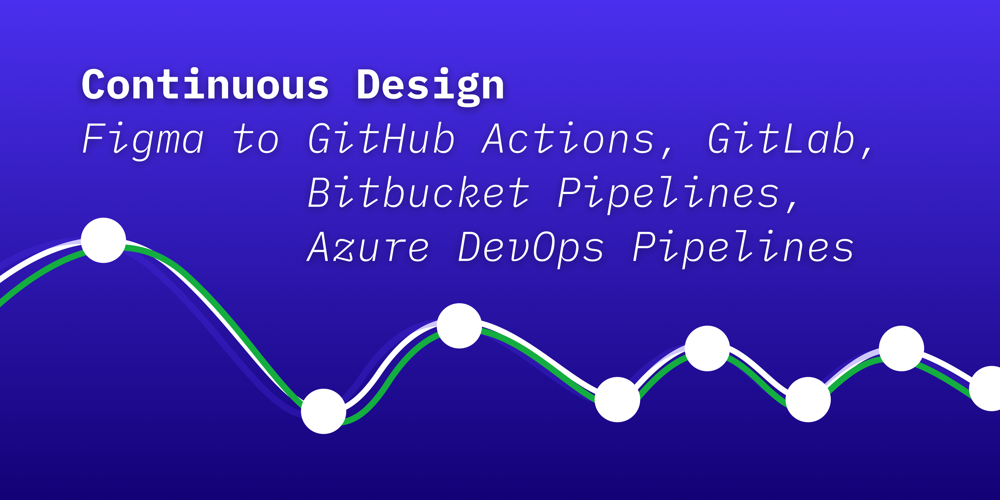
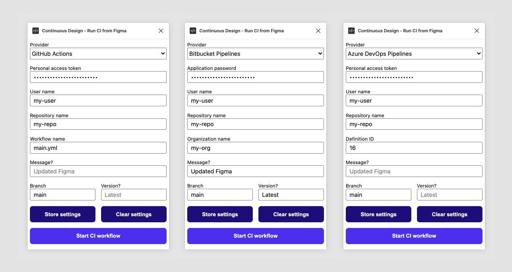

# Continuous Design — Figma plugin

**Continuous Design** is a Figma plugin that lets you run GitHub Actions, Bitbucket Pipelines, and Azure DevOps Pipelines from Figma.

If you want to practice "continuous design" using Figma and a modern development toolchain, it may be time to start deploying design changes straight from Figma!

_Examples of using each provider in the Continuous Design Figma plugin._

## Prerequisites

You will need:

- An account with your provider
- A pre-existing repository with your provider
- A pre-existing CI workflow
  - For a GitHub reference, see my repo [github-ci-demo](https://github.com/mikaelvesavuori/github-ci-demo)
  - For a Bitbucket Pipelines reference, see my repo [bitbucket-ci-demo](https://github.com/mikaelvesavuori/bitbucket-ci-demo)
  - For an Azure DevOps Pipelines reference, see my repo [azure-devops-ci-demo](https://github.com/mikaelvesavuori/azure-devops-ci-demo)
- A means of authentication
  - **GitHub**: A personal access token (with "repo" scope"). You can create one at [https://github.com/settings/tokens](https://github.com/settings/tokens). If you are stuck, follow the instructions at [GitHub](https://docs.github.com/en/github/authenticating-to-github/keeping-your-account-and-data-secure/creating-a-personal-access-token).
  - **Bitbucket**: An application password. You can create one at [https://bitbucket.org/account/settings/app-passwords/](https://bitbucket.org/account/settings/app-passwords/). More [instructions here](https://support.atlassian.com/bitbucket-cloud/docs/app-passwords/).
  - **Azure**: A personal access token. [Instructions here](https://docs.microsoft.com/en-us/azure/devops/organizations/accounts/use-personal-access-tokens-to-authenticate?view=azure-devops&tabs=preview-page).

## Permissions and data collection

Depending on your provider, you will need either a personal access token or an application password. These are are the accepted ways of handling plugins and other external tooling in the GitHub/Bitbucket/Azure DevOps contexts.

**The plugin itself never sends this information anywhere other than to call the respective provider APIs.**

You can however decide to store the state of all fields privately within Figma. Doing so stores the current state (including the PAT value) in Figma's contained asyncStorage (essentially a sandboxed localStorage).

## Using the plugin

Given that you have the prerequisites under control, it's just a matter of filling out the fields.

The strictly necessary fields to get a success response are:

- **Personal access token/Application password**: Your token or password from GitHub/Bitbucket/Azure.
- **User name**: Your user name.
- **Repository name**: Your repository name as it appears in a typical URL.
- **Workflow name [GitHub only]**: Has to be specified in the style of `filename.yml`. Defaults to `main.yml`.
- **Organization name [Bitbucket only]**: Your organization's name (might also be called "workspace").
- **Definition ID [Azure only]**: The seemingly random (?) ID that each pipeline receives. The easiest way to get it is to navigate to your pipeline in the Azure Devops web console and check the URL bar which should look like: `https://dev.azure.com/YOUR_USER/YOUR_PROJECT/_build?definitionId=16`.
- **Branch**: Should be same as the branch you want to trigger. Defaults to `main`.

The optional fields are:

- **Message**: Can be used to provide the CI workflow some context on what's changed.
- **Version**: Can be used to provide the CI workflow information on a version. See the below example for how this can be used with—for example—Figmagic to pull data from a given version of your Figma document.

You will receive a popup/alert that informs you that the workflow is starting/failing.
