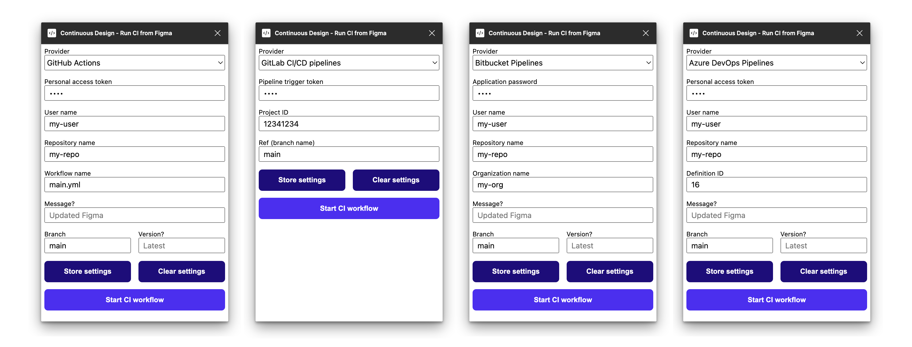

# Continuous Design: Figma to GitHub Actions plugin


Continuous Design is a Figma plugin that lets you run GitHub Actions workflows from Figma.

If you want to practice "continuous design" using Figma and a modern development toolchain, it may be time to start deploying design changes straight from Figma!



## Prerequisites

You will need:

- A [GitHub](https://github.com/) account
- A pre-existing repository in GitHub
- A pre-existing GitHub Actions workflow; for a reference see `github-actions-reference/main.yml` which is an example of running Figmagic in CI through the Figma GitHub Actions plugin
- A personal access token (with "repo" scope"); create one at [https://github.com/settings/tokens](https://github.com/settings/tokens). If you are stuck, follow instructions at [GitHub](https://docs.github.com/en/github/authenticating-to-github/keeping-your-account-and-data-secure/creating-a-personal-access-token).

## Instructions

Given that you have the above prerequisites under control, it's just a matter of filling out the fields.

The strictly necessary fields to get a success response are:

- **Personal access token**: Your repo-scoped token from GitHub.
- **GitHub user name**: Your GitHub user name.
- **Repository name**: Your repository name as it appears in a typical URL.
- **Workflow name**: Has to be specified in the style of `filename.yml`. Defaults to `main.yml`.
- **Branch**: Will point to GitHub's `ref` value. Should be same as the branch you want to trigger. Defaults to `main`.

The optional fields are:

- **Message**: Can be used to provide the CI workflow some context on what's changed.
- **Version**: Can be used to provide the CI workflow information on a version. See the below example for how this can be used with—for example—Figmagic to pull data from a given version of your Figma document.

## Example

Here's an example of running [Figmagic](https://github.com/mikaelvesavuori/figmagic) in CI with a push coming from the Continuous Design plugin.

_Note that the connection between Figmagic and GitHub Actions is not presented or handled below (this is usually a case of setting environment variables in the repository)._

```yaml
name: main

on:
  workflow_dispatch:
    inputs:
      message:
        description: 'Message. What changes were made?'
        required: false
        default: 'Updated Figma'
      version:
        description: 'Which version of the Figma document to use?'
        required: false
        default: '' # Will use latest if not set
  push:
    branches:
      - 'main'

jobs:
  build-unix:
    runs-on: ${{ matrix.os }}
    strategy:
      matrix:
        os: ['ubuntu-latest']
        node-version: [14.x]
    steps:
      - name: Inputs
        id: input-messages
        run: |
          echo "MESSAGE ---> '${{ github.event.inputs.message }}'"
          echo "VERSION ---> '${{ github.event.inputs.version }}'"

      - name: Checkout
        id: checkout
        uses: actions/checkout@v2

      - name: Use Node.js ${{ matrix.node-version }}
        id: node
        uses: actions/setup-node@v2
        with:
          node-version: ${{ matrix.node-version }}

      - name: Install Figmagic
        id: install
        run: npm install -D figmagic

      - name: Run Figmagic and use latest Figma data
        id: figma-latest
        if: ${{ !github.event.inputs.version }}
        run: node node_modules/figmagic/build/index.js

      - name: Run Figmagic and use named version of Figma data
        id: figma-versioned
        if: ${{ github.event.inputs.version }}
        run: node node_modules/figmagic/build/index.js -- --versionName ${{ github.event.inputs.version }}
```

## References

- [GitHub: Personal access tokens](https://github.com/settings/tokens)
- [GitHub: Getting started with the REST API](https://docs.github.com/en/rest/guides/getting-started-with-the-rest-api)
- [GitHub: Create a workflow dispatch event](https://docs.github.com/en/rest/reference/actions#create-a-workflow-dispatch-event)
- [GitHub: Events that trigger workflows](https://docs.github.com/en/actions/reference/events-that-trigger-workflows#workflow_dispatch)
